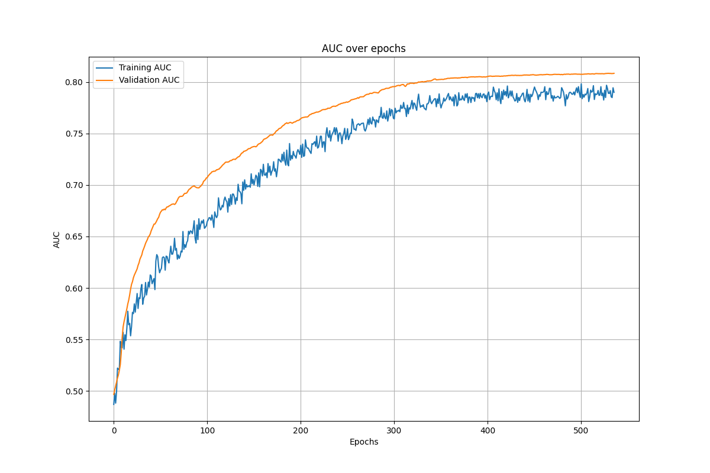
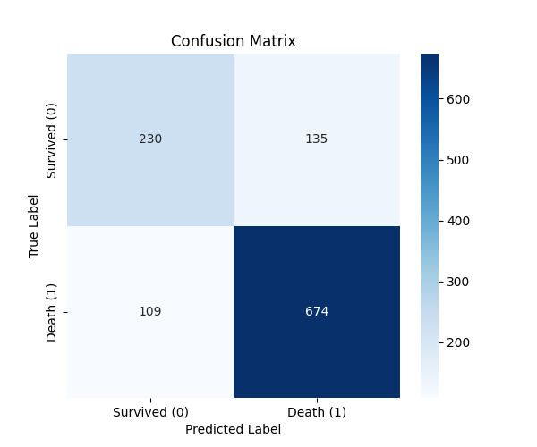

# ICU Mortality Prediction

## Overview
This project focuses on predicting in-hospital mortality for ICU patients using a comprehensive clinical dataset. The data undergoes extensive preprocessing, feature engineering, and is modeled with a deep learning approach. Evaluation includes cross-validation, metric tuning, and interpretability analysis.

## Dataset
The dataset includes patient demographic data, lab measurements, comorbidities, and ICU-specific indicators. Missing values are handled through imputation.

### Dataset Highlights:
- Features: Age, scoma, bilirubin (bili), pafi, aps, diabetes, glucose, bun, and more.
- Target: `death` (0 = Survived, 1 = Death)

## Project Workflow
1. **Exploratory Data Analysis (EDA)**
   - Missing value heatmap and percentage analysis
   - Feature distributions after imputation
   - Correlation heatmap

2. **Model Development**
   - Neural network model built using Keras
   - Monitored AUC and loss over epochs
   - Stratified K-Fold cross-validation

3. **Performance Evaluation**
   - Confusion matrix analysis
   - Metric variability across folds
   - Threshold tuning for precision-recall-F1 trade-off

4. **Interpretability**
   - SHAP plots to understand feature contributions

## Visual Results
### Missing Data Visualization
- Missing percentage per feature and heatmap 


### Feature Distributions
- Distributions of Bili and Pafi after imputation 


### Correlation Analysis
- Correlation of charges, total costs with other features


### Model Training Metrics
- **AUC over epochs** 



- **Loss over epochs**


### Model Evaluation
- Confusion Matrix



- Metric variability across folds


### Explainability
- SHAP feature importance summary 

## Model Performance
| Metric      | Average (Cross-Validation) |
|-------------|-----------------------------|
| Accuracy    | ~0.80                      |
| AUC         | ~0.84                      |
| F1-Score    | ~0.85                      |

## Installation
To set up the project environment:
```bash
pip install -r requirements.txt
```

## Running the Project
1. Open `main.ipynb` to view code, data processing, training, and evaluation steps.
2. Outputs and visualizations are automatically generated and saved.

## Model Loading Example
```python
from tensorflow.keras.models import load_model
model = load_model("icu_mortality_model.h5")
```

## References
- [Keras Documentation](https://keras.io/)
- [SHAP Documentation](https://shap.readthedocs.io/)
- [Matplotlib Documentation](https://matplotlib.org/)

